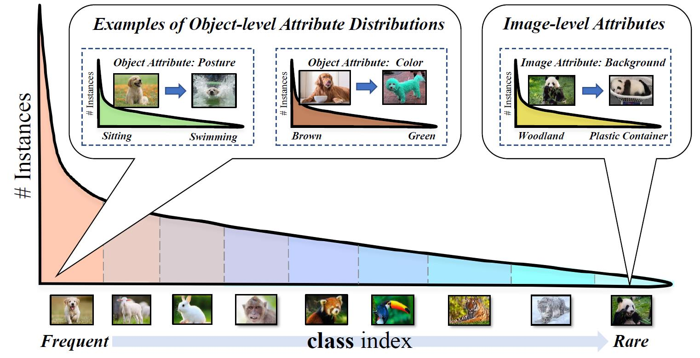

# Generalized Long-tailed Classification (GLT) Benchmarks
This project introduces a new long-tailed challenge that incorporates both the conventional class-wise imbalance and the overlooked attribute-wise imbalance within each class.

## Contents
1. [Background](#background)
2. [Install the Requirements](#install-the-requirement)
3. [Prepare GLT Datasets](#prepare-glt-datasets)
4. [Evaluation Protocols and Metrics](#evaluation-protocols-and-metrics)
5. [Conduct Training](#conduct-training)
6. [Conduct Testing](#conduct-testing)
7. [Add Custom Models](#add-custom-models)
8. [Observations](#observations)

## Background
Existing long-tailed classification methods only focus on tackling the **class-wise imbalance** (*head classes have more samples than tail classes*), but overlook the **attribute-wise imbalance** (*the intra-class distribution is also long-tailed due to the varying attributes*). If we look at samples inside each class in Figure 1, their attributes may also exhibit long-tailed distributions, e.g., there are more sitting dogs than swimming dogs, there are more brown dogs than green dogs. Therefore, simply considering the class distribution won't explain all the phenomena caused by imbalanced data. To be specific, 1) why the performance within each class is also long-tailed? 2) why images are usually mis-classified as classes with similar attributes? The attribute bias is thus incorporated into the proposed generalized long-tailed classification to answer the above questions.  

However, most of the conventional long-tailed classification benchmarks, e.g., [ImageNet-LT](https://github.com/zhmiao/OpenLongTailRecognition-OLTR), [Long-Tailed CIFAR-10/-100](https://github.com/Megvii-Nanjing/BBN), or [iNaturalist](https://github.com/inaturalist/inaturalist), are only capable of evaluating the class bias, underestimating the role of the attribute bias in the long tail challenge. To better evaluate the robustness of models in terms of both inter-class imbalance (class-level) and intra-class imbalance (attribute-level) at the same time, this project will introduce two GLT benchmarks and three evaluation protocols.


<p align = "center"></p>
<p align = "center"><b>Figure 1. The real-world long-tailed distribution is both class-wise and attribute-wise imbalanced.</b></p>

## Install the Requirement
- Pytorch >= 1.6.0 (CUDA 10.2)
- torchvision >= 0.7.0

```bash
###################################
###  Step by Step Installation   ##
###################################

# 1. create and activate conda environment
conda create -n glt_benchmark pip python=3.6
conda activate glt_benchmark

# 2. install pytorch and torchvision
conda install pytorch torchvision cudatoolkit=10.2 -c pytorch

# 3. install other packages
pip install sklearn joblib randaugment pyyaml==5.4
conda install matplotlib

# 4. download this project
git clone https://github.com/KaihuaTang/Generalized-Long-Tail-Benchmarks.pytorch.git
```

## Prepare GLT Datasets
We propose two datasets for the Generalized Long-Tailed (GLT) classification tasks: ImageNet-GLT and MSCOCO-GLT. 
- For **ImageNet-GLT** [(link)](https://github.com/KaihuaTang/Generalized-Long-Tail-Benchmarks.pytorch/tree/main/_ImageNetGeneration), like most of the other datasets, we don't have attribute annotations, so we use feature clusters within each class to represent K ''pretext attributes''. In other words, each cluster represents a meta attribute layout for this class.
- For **MSCOCO-GLT** [(link)](https://github.com/KaihuaTang/Generalized-Long-Tail-Benchmarks.pytorch/tree/main/_COCOGeneration), we directly adopt attribute annotations from [MSCOCO-Attribute](https://github.com/genp/cocottributes) to construct our dataset.

Please follow the above links to prepare the datasets.

## Evaluation Protocols and Metrics
To systematically evaluate the robustness of models against class-wise imbalance, attribute-wise imbalance, and their joint effect, we introduce three protocols along with the above two benchmark datasets. 

### Class-wise Long Tail (CLT) Protocol
Same as the conventional long-tailed classification, we first adopt a class-wise and attribute-wise LT training set, called Train-GLT, which can be easily sampled from ImageNet and MSCOCO-Attribute using a class-wise LT distribution. We don’t need to intentionally ensure the attribute-wise imbalance as it’s ubiquitous and inevitable in any real-world dataset. The corresponding Test-CBL, which is i.i.d. sampled within each class, is a class-wise balanced and attribute-wise long-tailed testing set. **(Train-GLT, Test-CBL)** with the same attribute distributions and different class distributions can thus evaluate the robustness against the class-wise long tail.

### Attribute-wise Long Tail (ALT) Protocol
The training set Train-CBL of this protocol has the same number of images for each class and keeps the original long-tailed attribute distribution by i.i.d. sampling images within each class, so its bias only comes from the attribute. Meanwhile, Test-GBL, as the most important evaluation environment for GLT task, has to balance both class and attribute distributions. Test-GBL for ImageNet-GLT samples equal number of images from each “pretext attribute” and each class. Test-GBL for MSCOCO-GLT is a little bit tricky, because each object has multiple attributes, making strictly balancing the attribute distribution prohibitive. Hence, we select a fixed size of subset within each class that has the minimized standard deviation of attributes as the Test-GBL. As long as Test-GBL is relatively more balanced in attributes than Train-CBL, it can serve as a valid testing set for ALT protocol. In summary, **(Train-CBL, Test-GBL)** have the same class distributions and different attribute distributions.

### Generalized Long Tail (GLT) Protocol
This protocol combines **(Train-GLT, Test-GBL)** from the above, so both class and attribute distributions are changed from training to testing. As the generalized evaluation protocol for the long-tailed challenge, an algorithm can only obtain satisfactory results when both class bias and attribute bias are well addressed in the final model.

### Evaluation Metrics
The top-1 accuracy is commonly adopted as the only metric in the conventional LT studies, yet, it cannot reveal the limitation of precision-accuracy trade-off. Therefore, in GLT classification, we report both **Accuracy** (#CorrectPredictions / #AllSamples), which is equal to Top-1 Recall in the class-wise balanced test sets, and **Precision** (1 / #Class * SUM over class (#CorrectPredictions / #SamplesPredictedAsThisClass)), to better evaluate the effectiveness of algorithms.

## Conduct Training

### Train Baseline Models
Run the following command to train a baseline model on Train-GLT of MSCOCO-GLT:
```
CUDA_VISIBLE_DEVICES=0,1 python main.py --cfg config/COCO_LT.yaml --output_dir checkpoints/YOUR_PATH --require_eval --train_type baseline --phase train
```
Run the following command to train a baseline model on Train-CBL of MSCOCO-GLT:
```
CUDA_VISIBLE_DEVICES=0,1 python main.py --cfg config/COCO_BL.yaml --output_dir checkpoints/YOUR_PATH --require_eval --train_type baseline --phase train
```
Run the following command to train a baseline model on Train-GLT of ImageNet-GLT:
```
CUDA_VISIBLE_DEVICES=0,1 python main.py --cfg config/ImageNet_LT.yaml --output_dir checkpoints/YOUR_PATH --require_eval --train_type baseline --phase train
```
Run the following command to train a baseline model on Train-CBL of ImageNet-GLT:
```
CUDA_VISIBLE_DEVICES=0,1 python main.py --cfg config/ImageNet_BL.yaml --output_dir checkpoints/YOUR_PATH --require_eval --train_type baseline --phase train
```

### Train Other Models
You can easily switch pre-defined algorithms by change the value of --train_type. Details of our methods and re-implemented algorithms are under config/algorithms_config.yaml
This project currently support following methods:
1. --train_type baseline  (Cross-Entropy Baseline Model)
2. --train_type mixup (Cross-Entropy model with [Mixup](https://arxiv.org/abs/1710.09412) Augmentation)
3. --train_type TDE ([TDE](https://arxiv.org/abs/2009.12991) model)
4. --train_type BBN ([BBN](https://arxiv.org/abs/1912.02413) model)
5. --train_type LA ([Logit Adjustment](https://arxiv.org/abs/2007.07314) method)
6. --train_type LDAM ([LDAM](https://arxiv.org/abs/1906.07413) model)
7. --train_type RIDE ([RIDE](https://arxiv.org/pdf/2010.01809.pdf) model)
8. --train_type TADE ([TADE](https://arxiv.org/abs/2107.09249) model)
9. --train_type stage1 (The first stage feature learning for [Decoupling](https://arxiv.org/abs/1910.09217))
10. --train_type crt_stage2 (The second stage classifier fine-tuning using CRT classifier from [Decoupling](https://arxiv.org/abs/1910.09217))
11. --train_type lws_stage2 (The second stage classifier fine-tuning using LWS classifier from [Decoupling](https://arxiv.org/abs/1910.09217))
12. --train_type ride_stage2 (Trying to decouple stage 2 class-balanced classifier for RIDE)
13. --train_type Focal ([Focol loss](https://arxiv.org/abs/1708.02002))
14. --train_type FocalLA (Combine Focol loss with Logit Adjustment)
15. --train_type LFF ([Learning from Failure](https://arxiv.org/abs/2007.02561) model)
16. --train_type LFFLA (Combine Learning from Failure with logit Adjustment)


## Conduct Testing
Test on Train-GLT will automatically evaluate both CLT Protocl (Test-CBL) and GLT Protocol (Test-GBL), so you can run the following command to evaluate your model:
```
CUDA_VISIBLE_DEVICES=0,1 python main.py --cfg config/ImageNet_LT.yaml  --output_dir checkpoints/YOUR_PATH --require_eval --train_type baseline --phase test --load_dir checkpoints/YOUR_PATH/YOUR_CHECKPOINT.pth
```


## Add Custom Models
To add a custom model, you 1) first need to design a ''train_XXX.py'' file templated by ''train_baseline.py'', an additional ''test_XX.py'' may also be required, if your custom algorithm contains some special post-processing. 2) After that, you need to add the config of your algorithm into ''config/algorithms_config.yaml''. 3) Finally, to match the config with the train/test frameworks, you need to link them in the ''utils/train_loader.py'' and ''utils/test_loader.py''.


## Observations

1. Attribute-wise imbalance is fundamentally different from the class-wise imbalance for two reasons: 1) it's statistical distribution is forbidden during training as exhaustively annotating attributes is prohibitive, 2) multiple attributes tend to co-occur with each other in one object, making instance-wise re-weighting/re-sampling less effective, as every time we sample an object with a rare attribute, it simultaneously sample the co-occurred frequent attributes as well. (To be specific, in MSCOCO-GLT, even if we directly use the explicit attribute annotations, we are still unable to strictly balance the attribute distribution (we can only minimized its STD)).

2. Previous LT methods usually exhibit [precision-recall trade-off](https://arxiv.org/abs/2112.14380) between head and tail classes, therefore, we report both Accuracy, which is equal to Top-1 Recall in the class-wise balanced test sets, and Precision, to better evaluate the effectiveness of algorithms. We empirically found that the recent trend of improving both head and tail categories, though lack a formal definition in their approaches, are essentially trying to solve the GLT challenge. Benefit from the feature learning, these ensemble learning and data augmentation approaches can also serve as good baselines for the proposed GLT as well.
