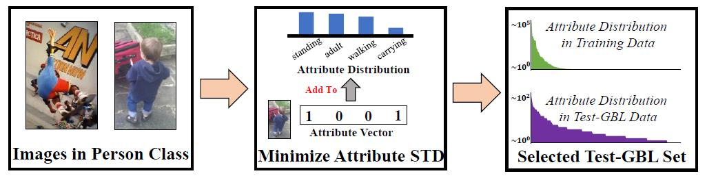
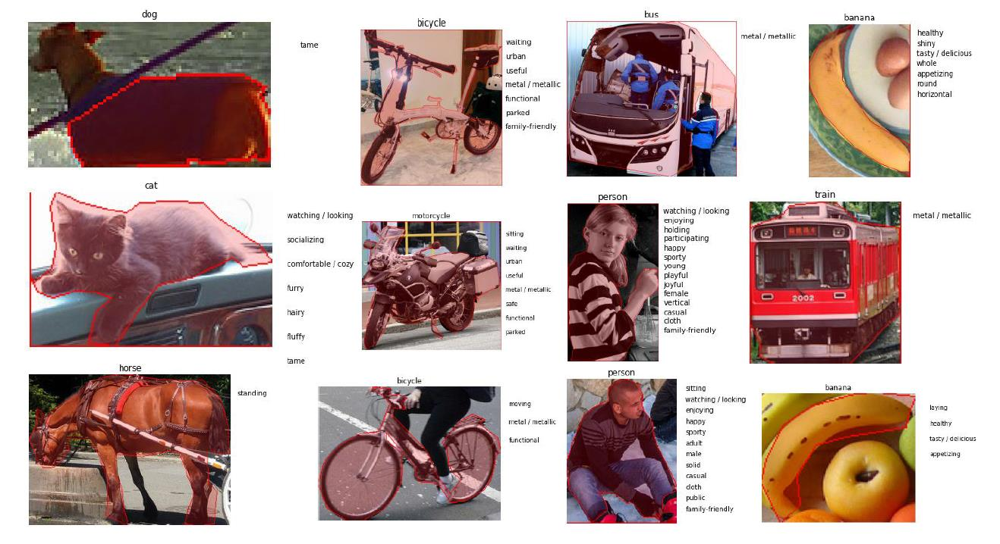
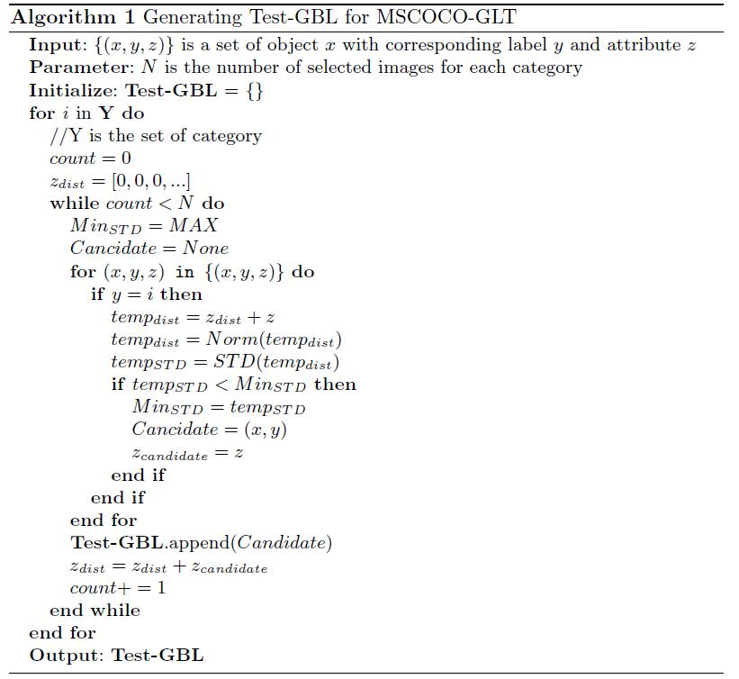
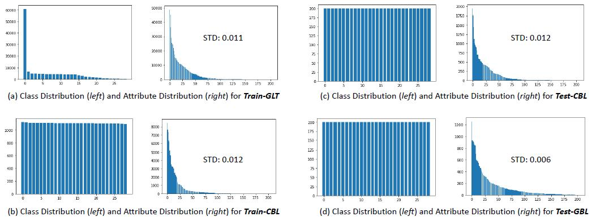

# MSCOCO-GLT Dataset Generation

## Introduction
<p align = "center"></p>
<p align = "center"><b>Figure 1. Balancing the Attribute Distribution of MSCOCO-Attribute Through Minimized STD.</b></p>

For MSCOCO-GLT, although we can directly obtain the attribute annotation from [MSCOCO-Attribute](https://github.com/genp/cocottributes), each object may have multiple attributes, making strictly balancing the attribute distribution prohibitive, as every time we sample an object with a rare attribute, it usually contain co-occurred frequent attributes as well. Therefore, as illustrated in the above Figure 1, we collect a subset of images with relatively more balanced attribute distributions (by minimizing STD of attributes) to serve as attribute-wise balanced test set. Other long-tailed split and class-wise splits are constructed the same as the ImageNet-GLT.

Note that the size of Train-CBL split is significantly smaller than Train-GLT, because one single super head class “person” contains over 40% of the entire data, making class-wise data re-balancing extremely expensive. The worse results on Train-CBL further proves the importance of long-tailed classification in real-world applications, as large long-tailed datasets are better than small balanced counterparts.

## Steps for MSCOCO-GLT Generation 
1. Download the [MSCOCO dataset](https://cocodataset.org/#download)
2. Download the [MSCOCO-Attribute Annotations](https://github.com/genp/cocottributes) (you can skip this step, as it has already included in this folder, i.e., cocoattributes_py3.jbl)
3. Construct training sets and testing sets for GLT, see [SplitGeneration.ipynb](2.SplitGeneration.ipynb). Note that we have three evaluation protocols: 1) Class-wise Long Tail with (Train-GLT, Test-CBL), 2) Attribute-wise Long Tail with (Train-CBL, Test-GBL), and 3) Generalized Long Tail with (Train-GLT, Test-GBL), where Class-wise Long Tail protocol and Generalized Long Tail protocol share the same training set Train-GLT, so there are two annotation files corresponding to two different training sets.
    1. coco_intra_lt_inter_lt.json: 
        1.  Train-GLT: classes and attribute clusters are both long-tailed
        2.  Test-GLT: same as above
        3.  Test-CBL: classes are balanced but the attribute clusters are still i.i.d. sampled within each classes, i.e., long-tailed intra-class distribution
        4.  Test-GBL: both classes and pretext attributes are balanced
    2. coco_intra_lt_inter_bl.json: 
        1. Train-CBL: classes are balanced, but the attribute clusters are still i.i.d. sampled within each classes, i.e., long-tailed intra-class distribution
        2. Test-CBL: same as above
        3. Test-GBL: both classes and pretext attributes are balanced
4. We further cropped each object from the original MSCOCO images to generate the image data, see [DataGeneration.ipynb](3.DataGeneration.ipynb).

## Commands
Run the following command to generate the MSCOCO-GLT annotations: 1) coco_intra_lt_inter_lt.json and 2) coco_intra_lt_inter_bl.json
```
python mscoco_glt_generation.py --data_path YOUR_COCO_IMAGE_FOLDER --anno_path YOUR_COCO_ANNOTATION_FOLDER --attribute_path ./cocottributes_py3.jbl
```
Run the following command to crop objects from MSCOCO images
```
python mscoco_glt_crop.py --data_path YOUR_COCO_IMAGE_FOLDER --output_path OUTOUT_FOLDER
```

## Visualization of Attributes and Dataset Statistics

<p align = "center"></p>
<p align = "center"><b>Figure 2. Examples of object with attributes in MSCOCO-GLT.</b></p>

<p align = "center"></p>
<p align = "center"><b>Figure 3. The algorithm used to generate Test-GBL for MSCOCO-GLT.</b></p>


<p align = "center"></p>
<p align = "center"><b>Figure 4. Class distributions and attribute distributions for each split of MSCOCO-GLT benchmark, where the most frequent category is the “person”. Although we cannot strictly balance the attribute distribution in Test-GBL split due to the fact that both head attributes and tail attributes can co-occur in one object, the selected Test-GBL has lower standard deviation of attributes than other splits..</b></p>


