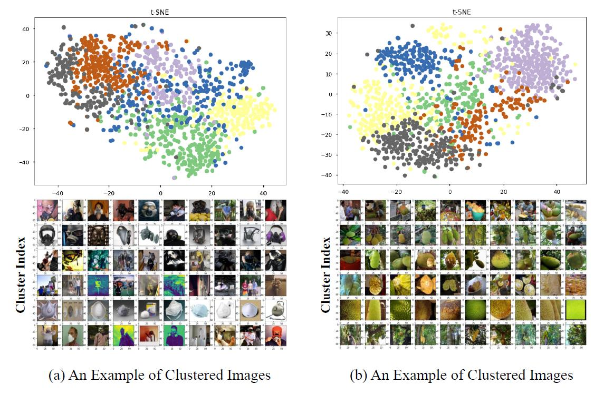
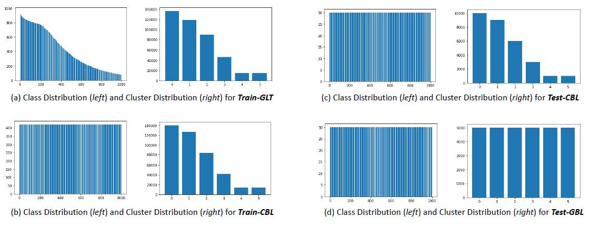

# ImageNet-GLT Dataset Generation

## Introduction

<p align = "center"></p>
<p align = "center"><b>Figure 1. Collecting an “Attribute-Wise Balanced” Test Set for ImageNet.</b></p>

For [ImageNet](https://ieeexplore.ieee.org/abstract/document/5206848) dataset, there is no ground-truth attribute labels for us to monitor the intra-class distribution and construct the GLT benchmark. However, attribute-wise long-tailed distribution, i.e., intra-class imbalance, is commonly existing in all kinds of data. Therefore, we can apply the clustering algorithms (e.g. K-Means in our project) to create a set of clusters within each class as ``pretext attributes''. In other words, each cluster represents a meta attribute layout for this class, e.g., one cluster for cat category can be ginger cat in house, another cluster for cat category is black cat on street, etc. 

Note that our clustered attributes here are purely constructed based on intra-class feature distribution, so it stands for all kinds of factors causing the intra-class variance, including object-level attributes like textures, or image-level attributes like contexts. 

## Steps for ImageNet-GLT Generation 
1. Download the [ImageNet dataset](https://image-net.org/download.php)
2. Use a pre-trained model to extract features (our default choice is ii: A torchvision Pre-trained ResNet):
    1. [MoCo Pre-trained Model](https://github.com/facebookresearch/moco), see [MoCoFeature.ipynb](1.MoCoFeature.ipynb)
    2. Torchvision Pre-trained ResNet, see [SupervisedFeature.ipynb](1.SupervisedFeature.ipynb)
    3. Using MMD-VAE with reconstruction loss to train a model and extract features, see [UnsupervisedFeature.ipynb](1.UnsupervisedFeature.ipynb)
3. Apply the K-Means algorithm to cluster images within each class into K (6 by default) pretext attributes based on extracted features
4. Construct training sets and testing sets for GLT, see [SplitGeneration.ipynb](2.SplitGeneration.ipynb). Note that we have three evaluation protocols: 1) Class-wise Long Tail with (Train-GLT, Test-CBL), 2) Attribute-wise Long Tail with (Train-CBL, Test-GBL), and 3) Generalized Long Tail with (Train-GLT, Test-GBL), where Class-wise Long Tail protocol and Generalized Long Tail protocol share the same training set Train-GLT, so there are two annotation files corresponding to two different training sets.
    1. imagenet_sup_intra_lt_inter_lt.json: 
        1.  Train-GLT: classes and attribute clusters are both long-tailed
        2.  Test-GLT: same as above
        3.  Test-CBL: classes are balanced but the attribute clusters are still i.i.d. sampled within each classes, i.e., long-tailed intra-class distribution
        4.  Test-GBL: both classes and pretext attributes are balanced
    2. imagenet_sup_intra_lt_inter_bl.json: 
        1. Train-CBL: classes are balanced, but the attribute clusters are still i.i.d. sampled within each classes, i.e., long-tailed intra-class distribution
        2. Test-CBL: same as above
        3. Test-GBL: both classes and pretext attributes are balanced


## Download Our Generated Annotation files
You can directly download our generated json files from [the link](https://1drv.ms/u/s!AmRLLNf6bzcitKlpBoTerorv5yaeIw?e=0bw83U).

Since OneDrive links might be broken in mainland China, we also provide the following alternate link using BaiduNetDisk:

Link：https://pan.baidu.com/s/1VSpgMVfMFnhQ0RTMzKNIyw  Extraction code：1234

## Commands
Run the following command to generate the ImageNet-GLT annotations: 1) imagenet_sup_intra_lt_inter_lt.json and 2) imagenet_sup_intra_lt_inter_bl.json
```
python imagenet_glt_generation.py --data_path YOUR_IMAGENET_FOLDER_FOR_TRAINSET
```

## Visualization of Clusters and Dataset Statistics

<p align = "center"></p>
<p align = "center"><b>Figure 2. Examples of feature clusters using KMeans (through t-SNE) and the corresponding visualized images for each cluster in the original ImageNet.</b></p>


<p align = "center"></p>
<p align = "center"><b>Figure 3. Class distributions and cluster distributions for each split of ImageNet-GLT benchmark. Note that clusters may represent different attribute layouts in each classes, so ImageNet-GLT actually has 6 × 1000 pretext attributes rather than 6, i.e, each column in the cluster distribution stands for 1000 pretext attributes having the same frequency.</b></p>
